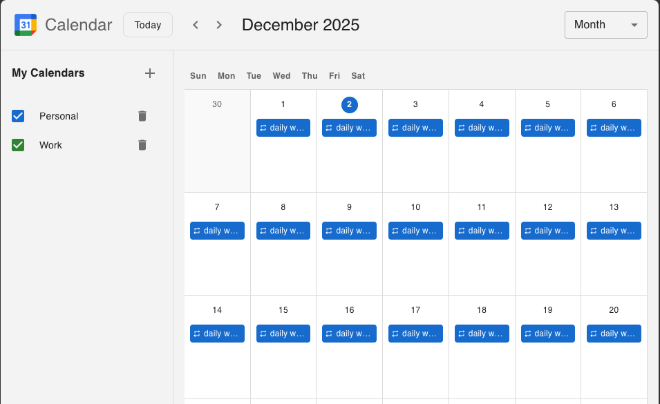

# bh-simple-calendar

一個簡潔優雅的日曆應用程式，使用 React 建構。所有資料都儲存在瀏覽器的 IndexedDB 中 - 不需要後端伺服器！



🔗 **線上 Demo：** [https://bh-simple-calendar.web.app/](https://bh-simple-calendar.web.app/)

## ✨ 功能特色

- 📅 **月曆檢視** - 乾淨直觀的日曆介面
- 🔄 **重複事件** - 支援每日、每週、每月、每年的重複事件（使用 RRule）
- ✏️ **例外處理** - 可編輯或刪除重複事件的單一實例（類似 Google 日曆）
- 🎨 **多日曆管理** - 建立和管理多個不同顏色的日曆
- 💾 **本地儲存** - 所有資料儲存在瀏覽器的 IndexedDB，可離線使用
- 📤 **匯出/匯入** - 備份和還原您的日曆資料

## 🛠️ 技術棧

- React 19
- Vite 7
- Material-UI (MUI) 7
- date-fns
- RRule（重複事件）
- IndexedDB（本地儲存）

## 🚀 快速開始

### 安裝依賴

```bash
npm install
# 或
yarn install
```

### 啟動開發伺服器

```bash
npm run dev
# 或
yarn dev
```

開發伺服器預設會在 http://localhost:5173 啟動。

### 建置生產版本

```bash
npm run build
# 或
yarn build
```

### 預覽生產版本

```bash
npm run preview
# 或
yarn preview
```

### 程式碼檢查

```bash
npm run lint
# 或
yarn lint
```

## 📁 專案結構

```
MySimpleCalendar/
├── public/              # 靜態資源
├── src/
│   ├── components/      # React 元件
│   │   ├── Calendar/    # 日曆檢視元件
│   │   ├── Events/      # 事件對話框元件
│   │   └── Sidebar/     # 側邊欄元件
│   ├── services/        # API 和資料庫服務
│   │   ├── api.js       # 使用 IndexedDB 的 API 層
│   │   └── db.js        # IndexedDB 操作
│   ├── utils/           # 工具函式
│   │   └── rruleHelper.js  # RRule 工具
│   ├── App.jsx          # 主應用程式元件
│   └── main.jsx         # 應用程式進入點
├── index.html
├── package.json
└── vite.config.js
```

## 🗄️ 資料庫結構 (IndexedDB)

### Calendars 儲存區（日曆）

| 欄位 | 類型 | 說明 |
|------|------|------|
| `id` | Number | 主鍵（自動遞增） |
| `name` | String | 日曆名稱 |
| `color` | String | 顯示顏色（十六進位，如 `#1976d2`） |
| `description` | String | 日曆描述 |
| `created_at` | String | 建立時間（ISO 8601） |
| `updated_at` | String | 最後更新時間（ISO 8601） |

### Events 儲存區（事件）

| 欄位 | 類型 | 說明 |
|------|------|------|
| `id` | Number | 主鍵（自動遞增） |
| `calendar_id` | Number | 所屬日曆 ID（外鍵） |
| `title` | String | 事件標題 |
| `description` | String | 事件描述 |
| `start_time` | String | 開始時間（ISO 8601） |
| `end_time` | String | 結束時間（ISO 8601） |
| `all_day` | Number | 全天事件標記（0 或 1） |
| `location` | String | 事件地點 |
| `color` | String | 自訂顏色（可選） |
| `rrule` | String | RRule 重複規則字串 |
| `exdates` | String | 排除日期（逗號分隔，如 `2025-01-15,2025-01-22`） |
| `parent_event_id` | Number | 父事件 ID（用於例外實例） |
| `original_start_time` | String | 原始發生日期（用於例外實例） |
| `created_at` | String | 建立時間 |
| `updated_at` | String | 最後更新時間 |

**索引：**
- `calendar_id` - 依日曆篩選事件
- `start_time` - 日期範圍查詢
- `parent_event_id` - 尋找例外實例

## 🔄 重複事件（RRule）

本應用程式使用 [RRule](https://github.com/jakubroztocil/rrule) 函式庫來處理重複事件，遵循 iCalendar RFC 5545 規範。

### 運作原理

1. **單一資料庫記錄**：每個重複事件只儲存一筆記錄，包含 `rrule` 欄位
2. **前端展開**：前端根據 RRule 在可見日期範圍內展開所有實例
3. **高效儲存**：無論有多少次重複，都只儲存一筆記錄

### 架構設計：Client 端展開

本應用程式採用 **Client 端展開** 的架構處理重複事件。以下是運作流程與方案比較：

```
┌─────────────────┐
│   IndexedDB     │
│                 │
│  1 筆資料       │      只儲存規則，
│  rrule=DAILY    │      不儲存個別實例
└────────┬────────┘
         │
         ▼
┌─────────────────┐
│ expandEvents()  │      RRule 函式庫根據規則
│                 │      計算可見日期範圍內的
│ 使用 RRule 庫   │      所有發生日期
│ 計算發生日期    │
└────────┬────────┘
         │
         ▼
┌─────────────────┐
│   MonthView     │
│                 │      顯示 N 筆事件實例
│  12/1 ✓ 事件    │      （即時動態產生）
│  12/2 ✓ 事件    │
│  12/3 ✓ 事件    │
│  ...            │
└─────────────────┘
```

#### 方案比較

| 方案 | 優點 | 缺點 |
|------|------|------|
| **Client 端展開（本應用）** | 網路流量小、伺服器負擔輕、可離線使用 | Client 需支援 RRule、需處理時區問題 |
| **Server 端展開** | Client 簡單、時區處理統一 | 網路流量大、伺服器負擔重、必須指定日期範圍 |

**業界案例：**
- Google Calendar API 與 Microsoft Graph API 採用 Client 端展開（回傳 RRule，由 Client 展開）
- 部分企業內部系統為求簡化，採用 Server 端展開

### RRule 範例

| 模式 | RRule 字串 |
|------|------------|
| 每天 | `FREQ=DAILY` |
| 每個工作日 | `FREQ=WEEKLY;BYDAY=MO,TU,WE,TH,FR` |
| 每週一 | `FREQ=WEEKLY;BYDAY=MO` |
| 每月 15 日 | `FREQ=MONTHLY;BYMONTHDAY=15` |
| 每年 1 月 1 日 | `FREQ=YEARLY;BYMONTH=1;BYMONTHDAY=1` |
| 每天直到 12 月 31 日 | `FREQ=DAILY;UNTIL=20251231` |
| 每天，共 10 次 | `FREQ=DAILY;COUNT=10` |

### 例外處理機制

當您編輯或刪除重複事件的單一實例時：

1. **刪除單一實例**：該日期會加入 `exdates` 欄位
2. **編輯單一實例**：
   - 原始日期加入父事件的 `exdates`
   - 建立新的例外記錄，包含 `parent_event_id` 和 `original_start_time`
3. **刪除此次及之後**：修改 RRule 的 `UNTIL` 參數

```
┌─────────────────────────────────────────────────────────────┐
│                    重複事件（父事件）                        │
│  rrule: "FREQ=WEEKLY;BYDAY=MO"                             │
│  exdates: "2025-01-13,2025-01-20"                          │
└─────────────────────────────────────────────────────────────┘
                              │
              ┌───────────────┴───────────────┐
              ▼                               ▼
┌─────────────────────────┐     ┌─────────────────────────┐
│      例外實例           │     │      例外實例           │
│   parent_event_id: 1    │     │   parent_event_id: 1    │
│   original_start_time:  │     │   original_start_time:  │
│   "2025-01-13"          │     │   "2025-01-20"          │
│   title: "已修改..."    │     │   （已刪除 - 無記錄）    │
└─────────────────────────┘     └─────────────────────────┘
```

## 📝 授權

MIT

---

[English](./README.md)
